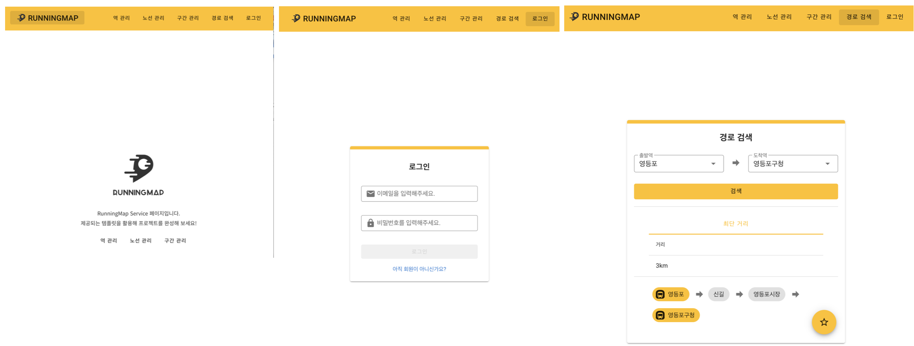

<p align="center">
    
</p>

<h2 align="middle">인프라공방</h2>
<p align="middle">지하철 노선도 서비스</p>
<p align="middle">

<p align="center">
  
  
  
</p>

<br>

## 💡 Introduction

<p align="middle">
  
</p>

[인프라공방 강의](https://inf.run/Ysu6U) 학습을 위한 예제 코드입니다. 미션 요구사항은 [블로그](https://www.brainbackdoor.com/infra)에서 확인할 수 있습니다.<br>

- 역 관리, 노선 관리, 구간 관리, 경로 검색 등의 지하철 노선 관리 기능
- 로그인, 회원 정보 수정, 즐겨찾기 등의 회원 관리 기능

<br>

## 🚀 Getting Started

### Install

```
sudo apt update
sudo apt install -y g++ build-essential
sudo apt install -y python2
alias python=python2

curl -o- https://raw.githubusercontent.com/nvm-sh/nvm/v0.34.0/install.sh | bash
. ~/.nvm/nvm.sh
nvm install 12.22.9
sudo apt install -y nodejs
```

### webpack server 구동
```
npm run dev
```
### application 구동
```
sudo apt install -y default-jre
sudo apt install -y default-jdk

./gradlew clean build
java -jar build/libs/subway-map-0.0.1-SNAPSHOT.jar 1> app.log 2>&1 &
```
<br>

## 🐞 Bug Report

버그를 발견한다면, [Issues](https://github.com/brainbackdoor/subway-map/issues) 에 등록해주세요.

<br>

## 📝 License

This project is [MIT](https://github.com/brainbackdoor/subway-map/blob/main/LICENSE) licensed.
